```{r setup, include=FALSE}
knitr::opts_chunk$set(echo = FALSE)
knitr::opts_chunk$set(message = FALSE)
library(knitr)
library(ggplot2)
library(dplyr)
library(mnormt)
library(circular)
library(tidyverse)
```


## The role of data science in ecology and environmental sciences

```{r, out.width = "500px"}

```


# PRESENTATION OVERVIEW

## Presentation Overview

1. A little about me...

2. Bayesian statistics primer

3. Collaborative research projects with Bayesian data science

# ABOUT ME

## Montana State University

>- Associate Professor of Statistics (_on sabbatical_)

```{r, out.width = "1000px"}
knitr::include_graphics("https://msuadmissions.files.wordpress.com/2012/11/prospectivewelcome.gif")
```


## My Research Philosophy

>- “The best thing about being a statistician is that you get to play in everyone’s backyard.” - John Tukey\

```{r, out.width = "700px"}
knitr::include_graphics("https://bloximages.chicago2.vip.townnews.com/missoulian.com/content/tncms/assets/v3/editorial/1/26/12683bb0-f297-5d98-aad8-f08d34b7a683/57b73db33ce8d.image.jpg?resize=1200%2C783")
```

## My Research Philosophy

>- “The best thing about being a statistician is that you get to play in everyone’s backyard.” - John Tukey\

```{r, out.width = "700px"}
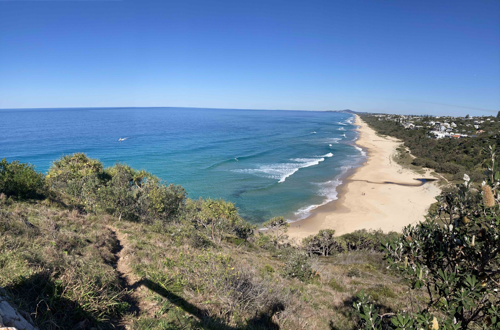
```

## My Research Philosophy

>- "Problem first, not solution backward" - Jeff Leek\
```{r, out.width = "450px"}
knitr::include_graphics("https://cdn.pixabay.com/photo/2012/04/13/20/57/hammer-33617__480.png")
```

## My Research Philosophy

>- "Problem first, not solution backward" - Jeff Leek\
```{r, out.width = "500px"}
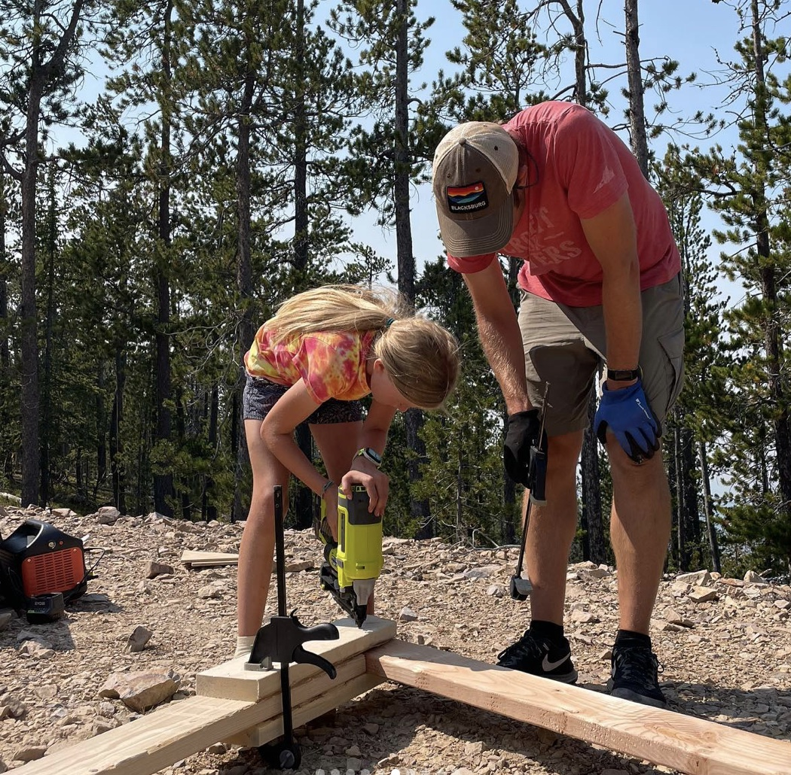
```

## My Research Philosophy

>- Understand and report uncertainty\

```{r, out.width = "1100px"}
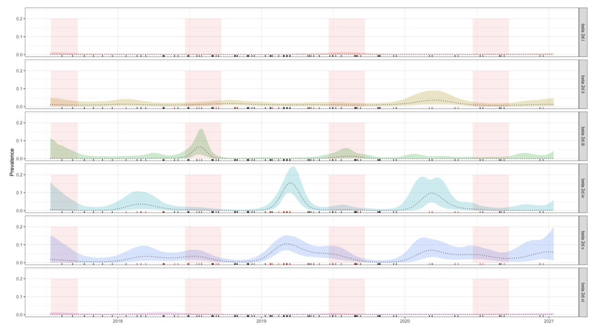
```

## My Research Philosophy

>- Create software for implementation

```{r, out.width = "1100px"}
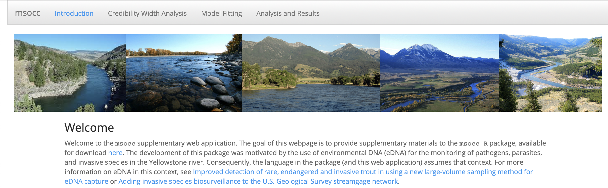
```

# BAYESIAN DATA SCIENCE

## Statistics?

```{r, out.width = "600px"}
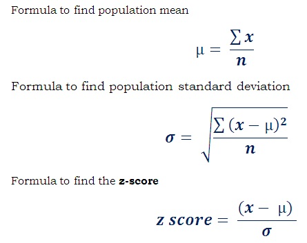
```

## Statistics?

```{r, out.width = "900px"}
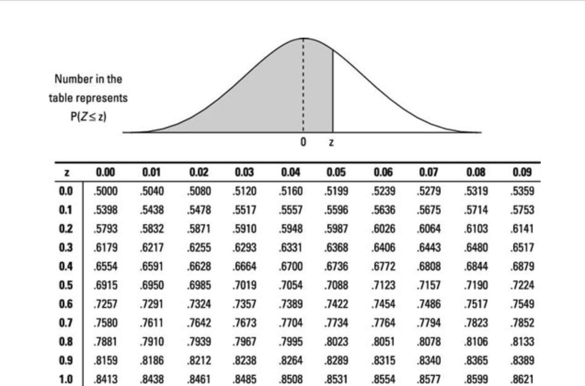
```

## Statistics?

```{r, out.width = "900px"}
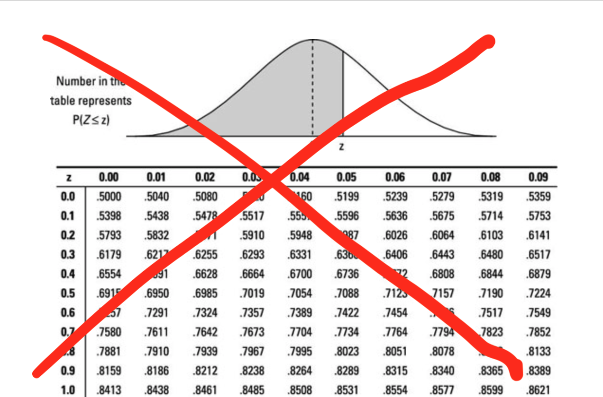
```

## Statistics?

```{r, out.width = "600px"}
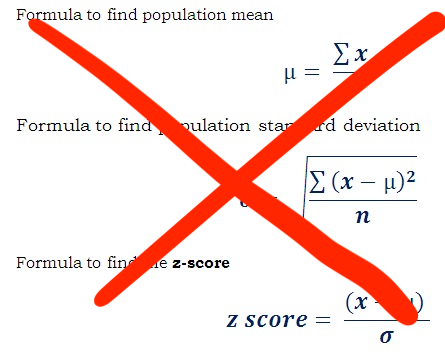
```

## Data Science $\neq$ Statistics

```{r, out.width = "600px"}
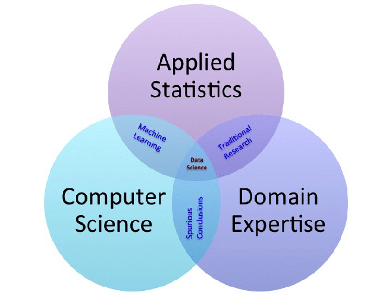
```

<small> source: Anderson, et. al 2015 </small>

## Bayesian Statistics Philosophy 

- Probability is used to account for all possible outcomes
- This requires a starting point (prior distribution)
- Prior beliefs are sequentially updated given additional information


## Matilda's Thought Example

>- __Thursday 20 July at 1 PM:__ What is your (probabilistic) belief that the Matilda's will win Group B in the World Cup?

```{r, out.width = "800px"}
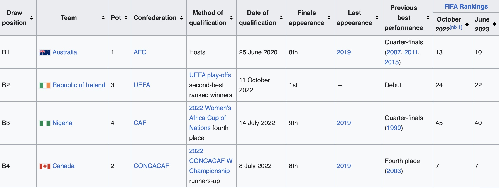
```


## Matilda's Thought Example

>- __Thursday 20 July at 6:45 PM:__ What is your (probabilistic) belief that the Matilda's will win Group B in the World Cup?


## Matilda's Thought Example

>- __Thursday 20 July at 6:45 PM:__ What is your (probabilistic) belief that the Matilda's will win Group B in the World Cup?

```{r, out.width = "800px"}
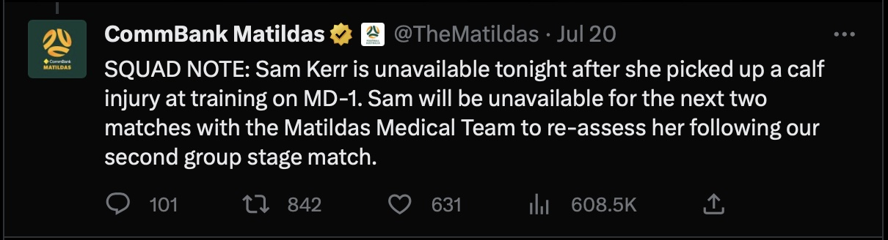
```


## Matilda's Thought Example

>- __Thursday 20 July at 9:15 PM:__ What is your (probabilistic) belief that the Matilda's will win Group B in the World Cup?


```{r, out.width = "800px"}
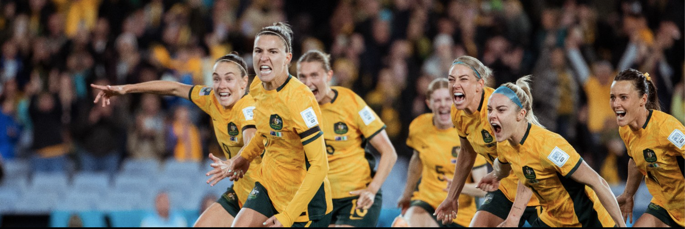
```


## Matilda's Thought Example

>- __Wednesday 26 July at 12:15 PM:__ What is your (probabilistic) belief that the Matilda's will win Group B in the World Cup?


```{r, out.width = "800px"}
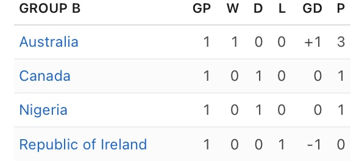
```


## Bayesian Updating

- Bayesian updating mimics human cognition

- Mathematical equation that controls the updating process

- $$p(\theta|X) = \frac{p(X|\theta) p(\theta)}{p(X)}$$

- Software exists to "solve" the equation

## Bayesian Software


```{r, out.width = "800px"}
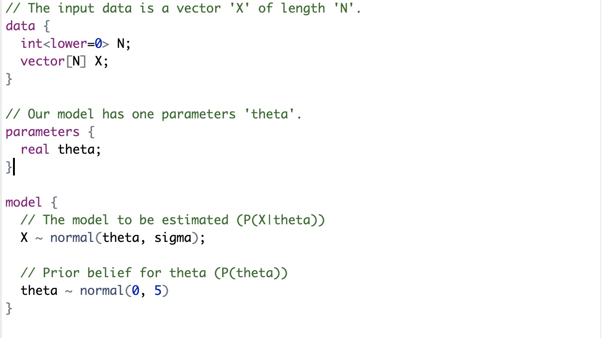
```

# COLLABORATIVE PROJECTS

## Grizzly Bear Range in GYE
```{r, out.width = "800px"}
knitr::include_graphics("https://www.nps.gov/yell/learn/nature/images/griz_sow.jpg?maxwidth=1200&maxheight=1200&autorotate=false")
```

## Aquatic Invasive Species

```{r, out.width = "600px"}
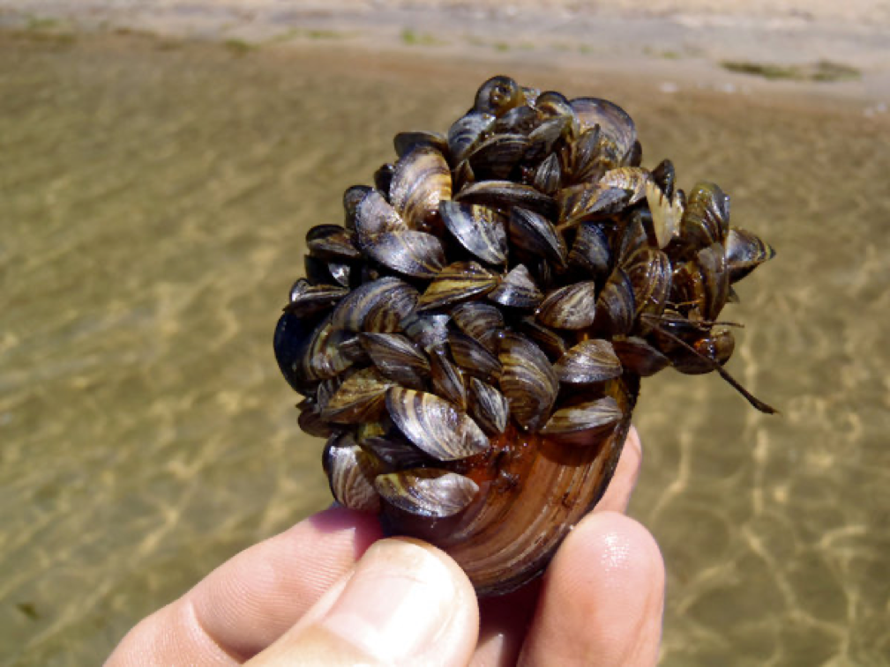
```

## EDNA Biosurveillance 

```{r, out.width = "800px"}
knitr::include_graphics("https://bloximages.chicago2.vip.townnews.com/missoulian.com/content/tncms/assets/v3/editorial/1/26/12683bb0-f297-5d98-aad8-f08d34b7a683/57b73db33ce8d.image.jpg?resize=1200%2C783")
```


## Vegetation Monitoring

```{r, out.width = "900px"}
knitr::include_graphics("Teton.png")
```

## Unexploded Ordnances

```{r, out.width = "800px"}
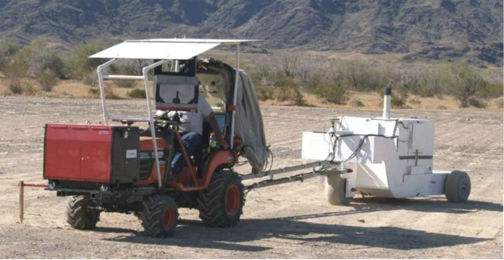
```

## Hendra Virus Spillover

```{r, out.width = "800px"}
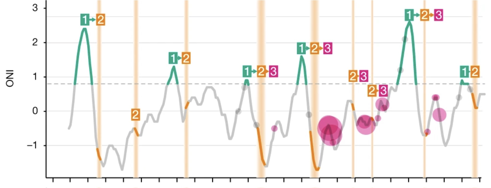
```


# Grizzly Bear Range in GYE

## with Frank van Manen and Mark Haroldson

```{r, out.width = "800px"}
knitr::include_graphics("https://www.nps.gov/yell/learn/nature/images/griz_sow.jpg?maxwidth=1200&maxheight=1200&autorotate=false")
```

## Greater Yellowstone Ecosystem
```{r, out.width = "800px"}
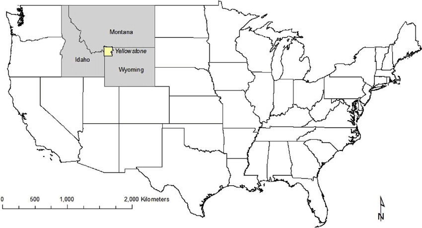
```

## Greater Yellowstone Ecosystem
```{r, out.width = "800px"}
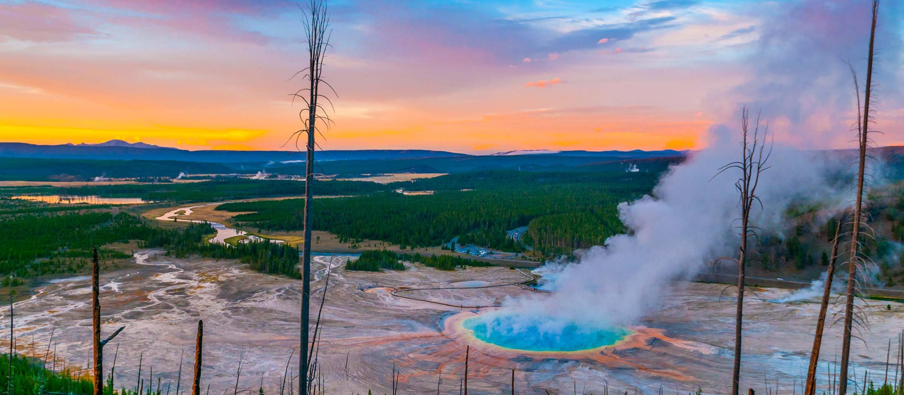
```

## Research Problem: Expanding Grizzly Range
```{r, out.width = "600px"}
knitr::include_graphics("https://d9-wret.s3.us-west-2.amazonaws.com/assets/palladium/production/s3fs-public/media/images/GYE-GB-Occupied-Range-1990-2020.gif")

```

## {data-background-video="animation.mp4"}

## Positional Data to Movement Modeling

```{r, out.width = "900px"}
knitr::include_graphics("turn_angle.png")
```

## Animal Movement Models

>- Step Length:\
```{r, out.width = '425px', }
tibble(stepsize = rgamma(1000, 1,.01)) %>% 
  ggplot(aes(x = stepsize)) +
  geom_histogram() + theme_minimal() +
  xlab('Step Size') + ylab('') 

```

>- Angular Direction:\
```{r, out.width = '425px', }
data.vm <- rvonmises(n=1000, mu=circular(0), kappa=3) 

# Plot data set. All points do not fit on plot.
plot(data.vm, stack=TRUE, bins=150, main = 'Histogram of Angular Data') 

```

## Independent Model

```{r, out.width = "600px"}
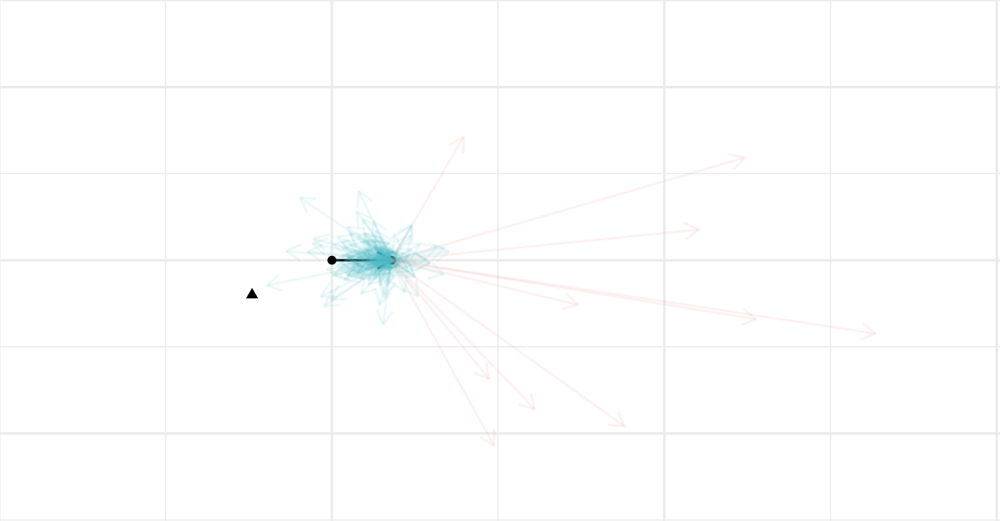
```

## Collective Model

```{r, out.width = "600px"}
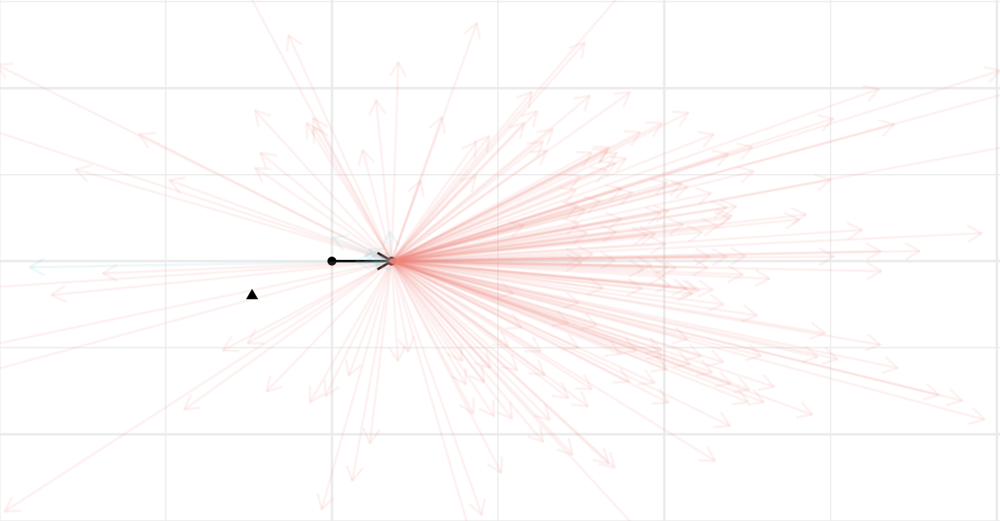
```

# Aquatic Invasive Species (Zebra Mussels)

## Meaghan Winder with Adam Sepulveda
```{r, out.width = "700px"}
knitr::include_graphics("https://mediad.publicbroadcasting.net/p/kufm/files/styles/large/public/201407/Boat_Check.jpg")
```

## Goal: evaluate current monitoring regime
```{r, out.width = "600px"}
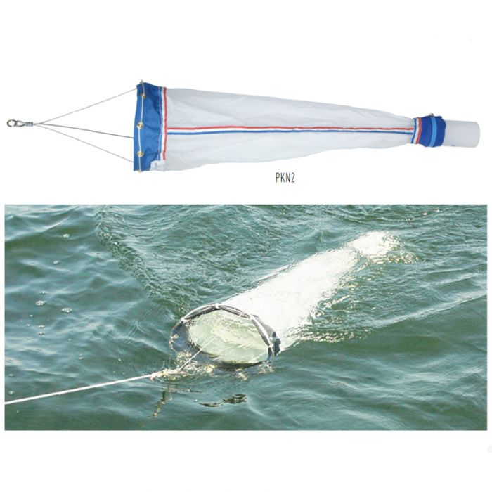
```

## Plankton Tows
```{r, out.width = "600px"}
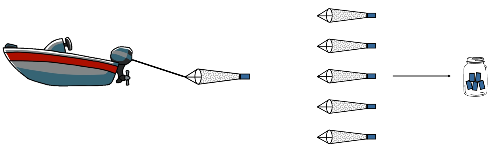
```

## Plankton Tows: Samples

Do we think zebra mussels are present?

```{r, out.width = "100px"}
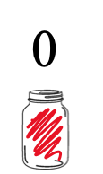
```

## Plankton Tows: Samples

Do we think zebra mussels are present?

```{r, out.width = "300px"}
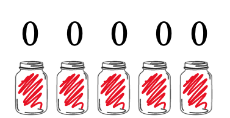
```

## Plankton Tows: Samples

How about now?

```{r, out.width = "600px"}
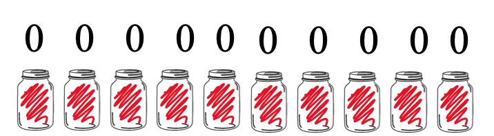
```

## Plankton Tows: Detection Probability

```{r, out.width = "900px"}
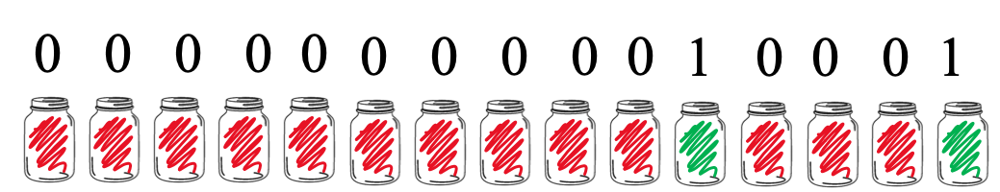
```

- In biological settings, many organisms are hard to detect
- Not identifying the organism does not mean it is not present
- Understanding _detection probability_ is essential for monitoring programs
- Statistics (occupancy models) can be used to estimate detection probability

## Sampling Intensity

For 90% detection, almost certainly need to increase sampling intensity

```{r, out.width = "800px"}
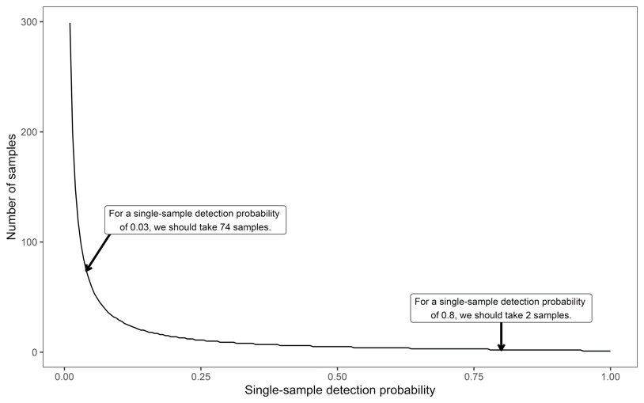
```


# EDNA BIOSURVEILLANCE 

## EDNA Biosurveillance 

### Christian Stratton with Adam Sepulveda

```{r, out.width = "600px"}
knitr::include_graphics("water.png")
```

## Goal: Develop computationally-efficient software for eDNA surveillance
```{r, out.width = "700px"}
knitr::include_graphics("https://www.nps.gov/yell/learn/nature/images/whitefish_ZacSexton.jpg?maxwidth=1200&maxheight=1200&autorotate=false")
```

## Data Collection

```{r, out.width = "650px"}
knitr::include_graphics("Data.png")
```

## EDNA Data Structure

>- Presence Data: 
```{r, out.width = "50px"}
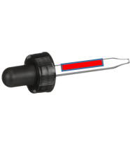
```
Species present AND species is detected with eDNA
	
- Absence Data:
```{r, out.width = "50px"}
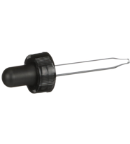
```
Species not present OR species is not detected with eDNA.

## Multiscale Occupancy Model

Two detection probabilities are necessary

>1. probability of detecting eDNA in bottle, given it is at site 

```{r, out.width = "50px"}
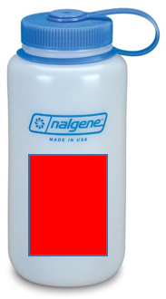
```


2. probability of detecting eDNA in the pipette, given it is in bottle 
```{r, out.width = "50px"}

```

## Efficient Computation and Software
```{r, out.width = "1000px"}

```

## Future Goals: _Streaming_ analysis

```{r, out.width = "500px"}
knitr::include_graphics("https://pbs.twimg.com/media/D35OZMtWsAI69XX.jpg")
```

# Climate Change Impacts on Plant Communities

## Climate Monitoring in Grand Teton NP

```{r, out.width = "900px"}
knitr::include_graphics("Teton.png")
```

with Christian Stratton and Kathi Irvine

## Goal: Evaluate Monitoring Plan

```{r, out.width = "500px"}
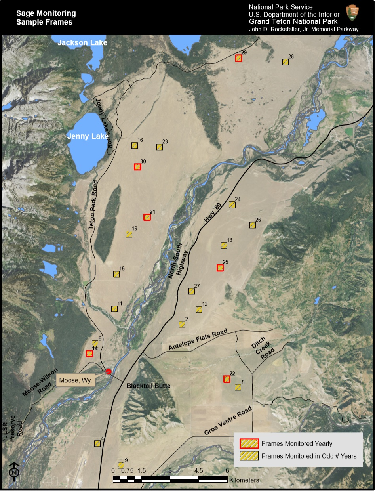
```

## Data collection

```{r, out.width = "500px"}
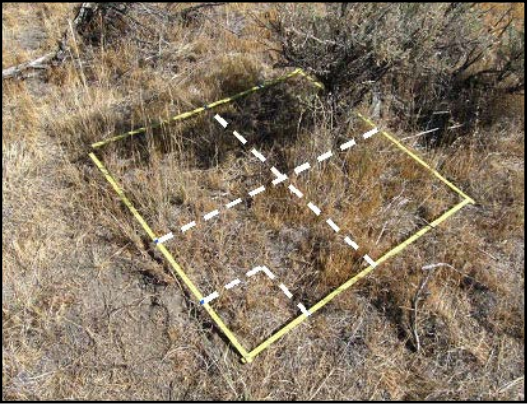
```

## Data structure

```{r, out.width = "900px"}
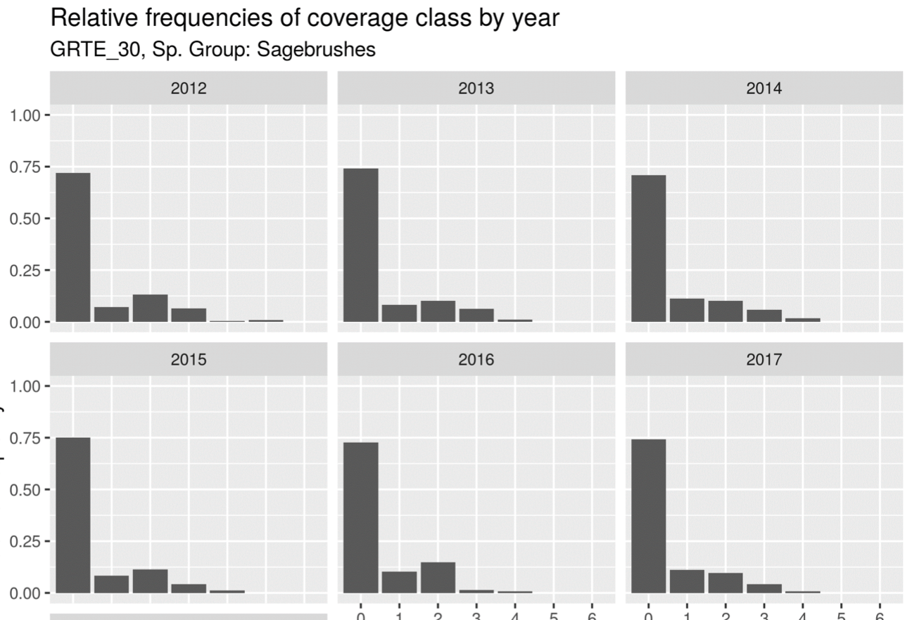
```

## Projection and Clustering

```{r, out.width = "800px"}
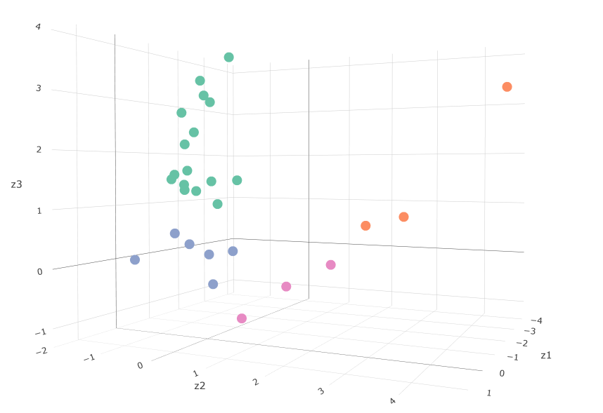
```

## Monitoring Plan 

>- Climate change related impacts will not be expected to vary dramatically from year-to-year

>- The composition of plant species can be projected into lower dimension to assess similarity. Differences can be assessed visually or with quantitative metrics.

>- Fewer grids/frames required on a yearly basis to identify large structural population differences.


# UXO detection

## Victorville Precision Bombing Range

```{r, out.width = "500px"}
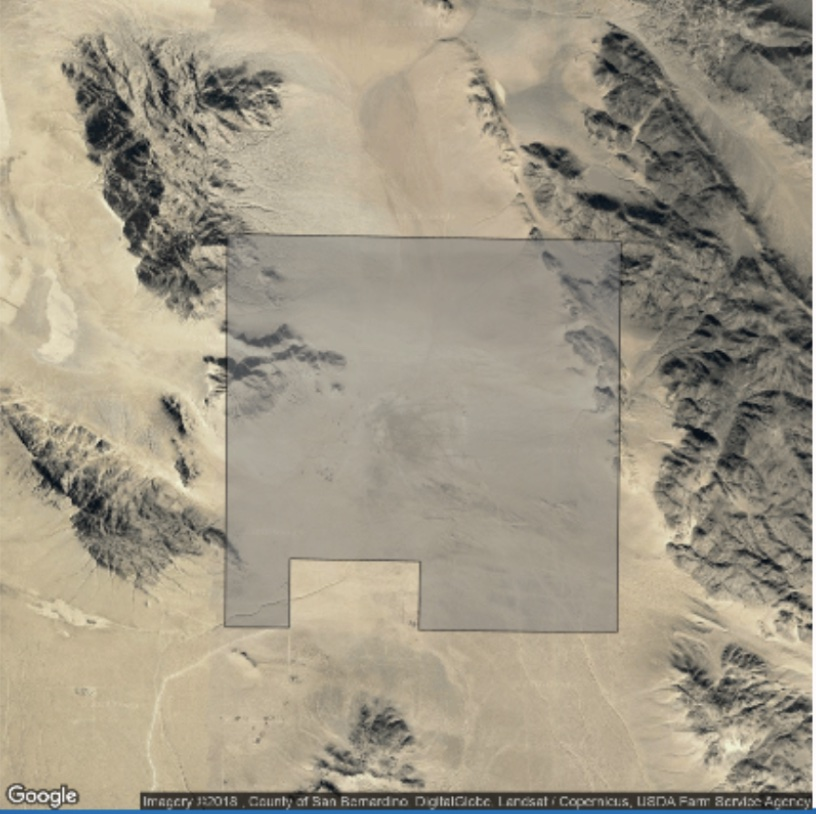
```

with Kenny Flagg and John Borkowski

## 


## 
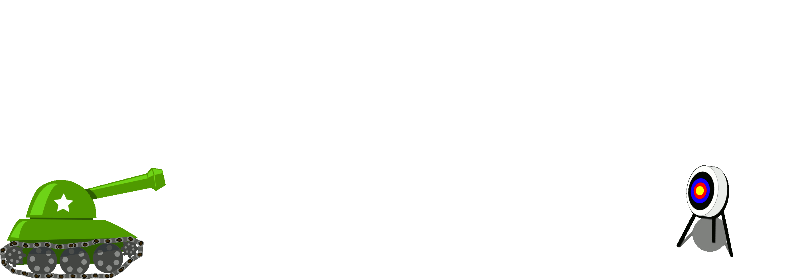

## 


## 


## Data Collection

```{r, out.width = "800px"}

```

## Metallic Anomolies

```{r, out.width = "600px"}
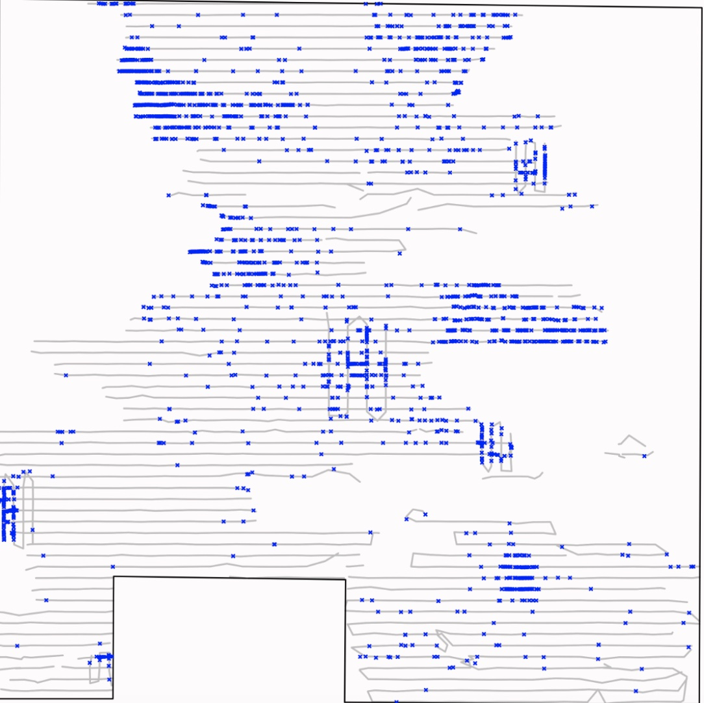
```

## Hot Spot Detection

```{r, out.width = "900px"}
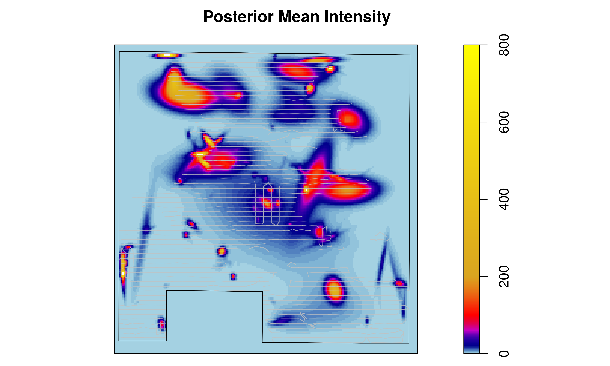
```

# Hendra Virus Spillover


## Hendra Virus Spillover

```{r, out.width = "900px"}

```

with Peggy Eby, Ali Peel, Wyatt Madden, John Giles, Peter Hudson, Raina Plowright


## Spillover vs. Food Availability

```{r, out.width = "700px"}
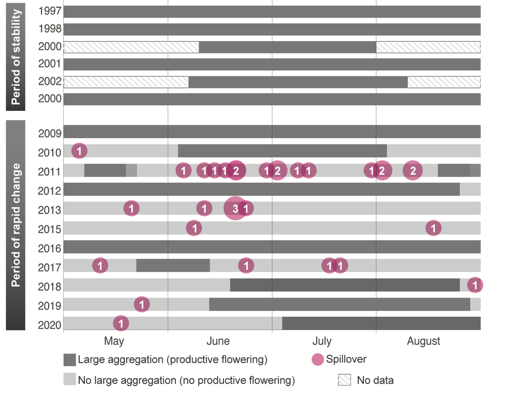
```

## Roost Land Use

```{r, out.width = "700px"}
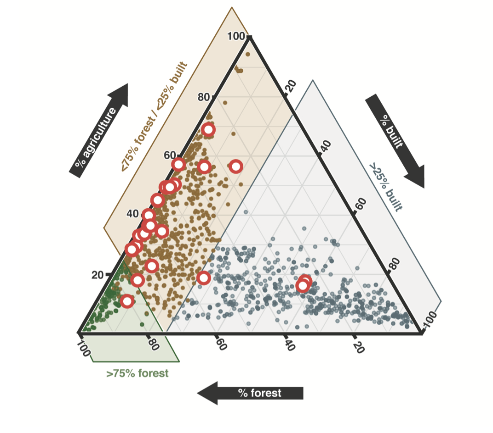
```

## Network Model

```{r, out.width = "900px"}
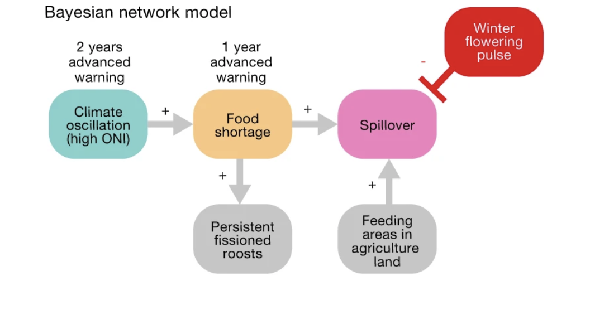
```

## Spillover Risk

```{r, out.width = "1000px"}
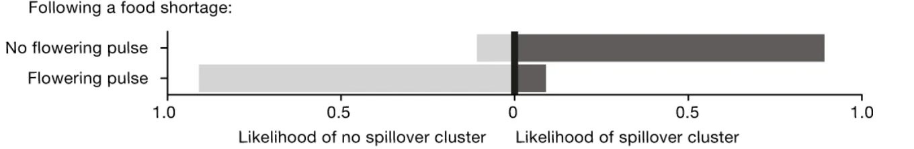
```

# THE END


## andrew.hoegh@montana.edu or a.hoegh@griffith.edu.au

```{r, out.width = "500px"}

```
